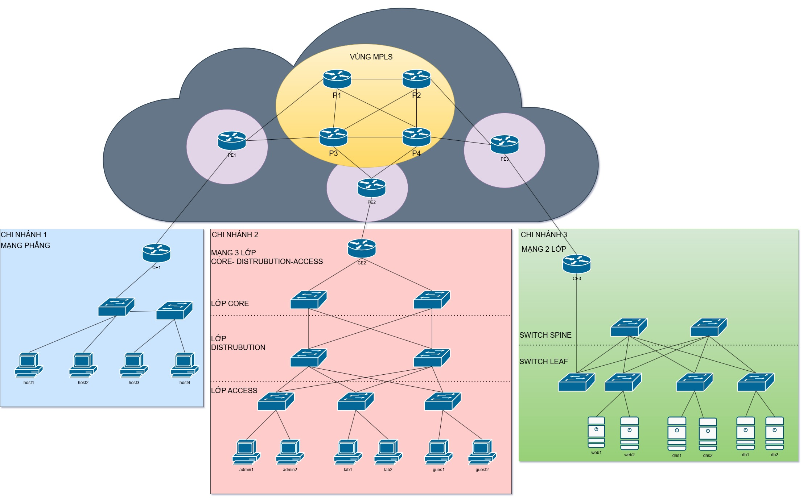

# 🌐 Mã Nguồn Dự Án: Thiết Kế & Triển Khai Mạng Metro Ethernet sử dụng MPLS

Dự án này tập trung vào thiết kế, cấu hình và đánh giá hiệu năng của hệ thống mạng diện rộng đô thị **Metro Ethernet MAN (Metropolitan Area Network)** sử dụng công nghệ chuyển mạch nhãn đa giao thức **MPLS (Multiprotocol Label Switching)**. Hệ thống kết nối 3 chi nhánh doanh nghiệp có kiến trúc mạng LAN nội bộ khác nhau qua hạ tầng mạng lõi ISP giả lập trên nền tảng **Mininet**.

---

## 📋 Mô tả dự án

Dự án triển khai mô hình mạng giả lập tích hợp đầy đủ hai phần chính:
1. **Hạ tầng ISP Backbone (MPLS Core)**: Bao gồm các Router PE (Provider Edge) tiếp nhận nhãn và Router P (Provider) thực hiện chuyển mạch nhãn tốc độ cao dựa trên giao thức định tuyến OSPF và phân phối nhãn LDP.
2. **Kiến trúc mạng nội bộ 3 chi nhánh (Customer Branches)**:
   - **Chi nhánh 1 (Flat LAN)**: Sử dụng mô hình mạng phẳng đơn giản, kiểm chứng hiện tượng nghẽn do bão quảng bá (Broadcast Storm).
   - **Chi nhánh 2 (3-Tier LAN)**: Sử dụng mô hình 3 lớp truyền thống (Core - Distribution - Access) có phân chia các VLAN (VLAN 10 Admin, VLAN 20 Lab, VLAN 30 Guest).
   - **Chi nhánh 3 (Leaf-Spine LAN)**: Sử dụng kiến trúc Spine-Leaf (2-Tier Clos) hiện đại tối ưu hóa băng thông bằng ECMP (Equal-Cost Multi-Path).

Dự án đi kèm bộ công cụ đo lường tự động (toolkit) thu thập dữ liệu **Throughput (Thông lượng), Delay (Độ trễ), Packet Loss (Tỷ lệ mất gói), và Jitter (Độ biến động trễ)** để vẽ biểu đồ và phân tích so sánh hiệu năng giữa các kiến trúc.

---

## 🏗️ Kiến trúc & Sơ đồ Topology

Hệ thống mạng được phân tách rõ ràng giữa mạng biên khách hàng (CE), mạng biên nhà cung cấp (PE), lõi chuyển mạch (P) và các phân vùng LAN chi nhánh:



### Sơ đồ Logic kết nối hệ thống:
```
┌─────────────────────────────────────────────────────────────────┐
│                    ISP BACKBONE (MPLS Core)                     │
│                                                                  │
│         PE1 ──── P1 ──── P2 ──── PE3                            │
│          │        │       │        │                             │
│          │        └── P3 ─┘        │                             │
│          └──── P3 ──── P4 ──── PE2                              │
│                  (full-mesh P1,P2,P3,P4)                        │
└────────────┬──────────────────┬─────────────────┬───────────────┘
             │                  │                  │
         CE1 │              CE2 │              CE3 │
             ▼                  ▼                  ▼
    ┌─────────────┐   ┌─────────────────┐  ┌──────────────────┐
    │ CHI NHÁNH 1 │   │   CHI NHÁNH 2   │  │   CHI NHÁNH 3    │
    │  Mạng phẳng │   │   Mạng 3 lớp    │  │   Leaf-Spine     │
    │  (Flat LAN) │   │ Core-Dist-Access│  │  (2-Tier Clos)   │
    │             │   │                 │  │                  │
    │ host1~host4 │   │admin/lab/guest  │  │ web/dns/db nodes │
    └─────────────┘   └─────────────────┘  └──────────────────┘
```

---

## 💻 Công nghệ sử dụng

Hệ thống được phát triển và chạy thử nghiệm trên môi trường ảo hóa với các công nghệ chính:
- **Hệ điều hành**: Ubuntu 20.04 LTS / Ubuntu 22.04 LTS
- **Môi trường ảo hóa**: VMware Workstation Pro / VirtualBox
- **Nền tảng mô phỏng mạng**: Mininet 2.3.0+ (Giả lập cấu trúc mạng Linux SDN)
- **Công nghệ Switch ảo**: Open vSwitch (OVS) hỗ trợ VLAN và OpenFlow
- **Ngôn ngữ phát triển**: Python 3.8+ (Mininet API & Scripts đo tự động)
- **Linux Kernel MPLS**: MPLS router & MPLS tunnels modules (`mpls_router`, `mpls_iptunnel`)
- **Công cụ kiểm thử & đo đạc**: `iperf3` (Đo băng thông UDP/TCP, Jitter), `ping` (Đo RTT, Loss)
- **Thư viện Python vẽ biểu đồ**: `matplotlib`, `numpy`, `pyyaml`

---

## 🚀 Cách chạy & Cài đặt chi tiết

### 1. Chuẩn bị môi trường (Cài đặt trên Ubuntu VM)

Mở terminal trên máy ảo Ubuntu và cài đặt các gói phụ thuộc cần thiết:

```bash
# Cập nhật danh sách gói
sudo apt-get update

# Cài đặt Mininet và Open vSwitch
sudo apt-get install -y mininet openvswitch-switch iperf3 python3-pip

# Khởi động dịch vụ Open vSwitch
sudo service openvswitch-switch start

# Cài đặt các thư viện Python để vẽ biểu đồ và phân tích
pip3 install matplotlib numpy pyyaml
```

### 2. Kích hoạt module MPLS trên Linux Kernel

Để Linux kernel hiểu và chuyển mạch được nhãn MPLS, hãy chạy các lệnh sau:

```bash
sudo modprobe mpls_router
sudo modprobe mpls_iptunnel

# Kiểm tra xem các module đã hoạt động chưa
lsmod | grep mpls
```

### 3. Tải mã nguồn dự án

```bash
git clone https://github.com/tanmanh-31102005/TKMCK.git
cd TKMCK/52300221_Source_Code
```

### 4. Các kịch bản chạy mô phỏng

#### ⚡ Cách 1: Chạy tự động toàn bộ quy trình đo đạc (Khuyến nghị)
Script `run_all_tests.sh` sẽ tự động khởi dựng mạng Mininet, chạy các kịch bản gửi tải mạng (10M, 50M, 100M), thu thập kết quả thô, xuất sang CSV và tự động vẽ 8 biểu đồ so sánh:

```bash
sudo chmod +x scripts/*.sh
sudo bash scripts/run_all_tests.sh
```
*Kết quả biểu đồ dạng ảnh PNG sẽ được lưu tại thư mục: `results/charts/`.*

#### 📊 Cách 2: Chạy chế độ giả lập nhanh (Mock mode)
Chạy kiểm tra logic vẽ biểu đồ và tính toán dữ liệu mà không cần cài đặt hoặc khởi động cấu hình mạng Mininet thực tế:

```bash
bash scripts/run_all_tests.sh --mock
```

#### 🔬 Cách 3: Chạy và kiểm tra từng chi nhánh độc lập
```bash
# Đo hiệu năng nội bộ Chi nhánh 1 (Flat LAN)
sudo bash scripts/run_flat_tests.sh

# Đo hiệu năng nội bộ Chi nhánh 2 (3-Tier LAN)
sudo bash scripts/run_3tier_tests.sh

# Đo hiệu năng nội bộ Chi nhánh 3 (Leaf-Spine LAN)
sudo bash scripts/run_leafspine_tests.sh
```

#### 🖥️ Cách 4: Khởi chạy thủ công và tương tác qua Mininet CLI
Khởi động toàn bộ topology tích hợp mạng MPLS xương sống và 3 LAN chi nhánh:

```bash
sudo python3 topology/metro_full.py
```

Khi cửa sổ dòng lệnh `mininet>` xuất hiện, bạn có thể thực hiện kiểm tra bằng các lệnh sau:

```bash
# 1. Kiểm tra kết nối từ Chi nhánh 1 sang Chi nhánh 3 qua mạng MPLS lõi
mininet> host1 ping -c 3 10.3.10.11

# 2. Ping kiểm tra thông suốt toàn bộ hệ thống
mininet> pingall

# 3. Xem bảng định tuyến nhãn MPLS (LFIB) trên Router lõi P1
mininet> p1 ip -f mpls route show

# 4. Xem quy tắc gắn nhãn (Encap) trên Router PE1
mininet> pe1 ip route show

# 5. Đo băng thông thực tế (TCP Throughput) giữa Web Server (Branch 3) và Host 1 (Branch 1)
mininet> web1 iperf3 -s &
mininet> host1 iperf3 -c 10.3.10.11 -t 10
```

---

## 📁 Cấu trúc thư mục mã nguồn

```
52300221_Source_Code/
├── 📄 README.md                       # File tài liệu kỹ thuật này
├── 🖼️  LOGIC.jpg                      # Sơ đồ topology mạng
│
├── 📁 topology/                       # Scripts định nghĩa mô hình mạng Mininet
│   ├── metro_full.py                  # Khởi dựng toàn bộ hệ thống (ISP + 3 Branches)
│   ├── topo_backbone_mpls.py          # Cấu hình mạng lõi ISP (PE1-PE3, P1-P4)
│   ├── topo_branch1_flat.py           # Thiết kế Chi nhánh 1 (Mạng phẳng)
│   ├── topo_branch2_3tier.py          # Thiết kế Chi nhánh 2 (Core-Dist-Access)
│   ├── topo_branch3_leafspine.py      # Thiết kế Chi nhánh 3 (Leaf-Spine)
│   ├── configure_mpls.py              # Script nạp cấu hình MPLS tĩnh trên Linux interfaces
│   └── configure_mpls_ldp.py          # Cấu hình phân phối nhãn MPLS LDP
│
├── 📁 scripts/                        # Các bộ công cụ đo lường và phân tích tự động
│   ├── run_all_tests.sh               # Tổng điều phối chạy test, parse kết quả và vẽ biểu đồ
│   ├── run_measurements.py            # Python điều phối iperf3/ping tự động
│   ├── parse_ping.py                  # Trích xuất dữ liệu độ trễ RTT từ log ping
│   ├── parse_iperf.py                 # Trích xuất thông lượng & jitter từ log iperf3
│   ├── aggregate_results.py           # Gộp dữ liệu từ các lần chạy thử nghiệm
│   └── plot_results.py                # Vẽ 8 biểu đồ biểu diễn hiệu năng bằng Matplotlib
│
├── 📁 config/
│   └── tests.yaml                     # File định nghĩa các tham số đo test (IP, băng thông, số lần lặp)
│
└── 📁 results/                        # Kết quả thu được sau khi chạy test
    ├── raw/                           # File log định dạng txt thô từ lệnh ping/iperf3
    ├── csv/                           # Dữ liệu dạng bảng CSV sau khi đã phân tích
    └── charts/                        # 8 Biểu đồ hiệu năng xuất dạng ảnh PNG
```

---

## 🛠️ Dọn dẹp hệ thống khi gặp sự cố

Trong trường hợp Mininet bị crash hoặc các dịch vụ mạng bị treo, chạy lệnh sau để dọn sạch tài nguyên ảo hóa:

```bash
sudo mn -c
sudo pkill -f iperf3
sudo pkill -f python3
```
